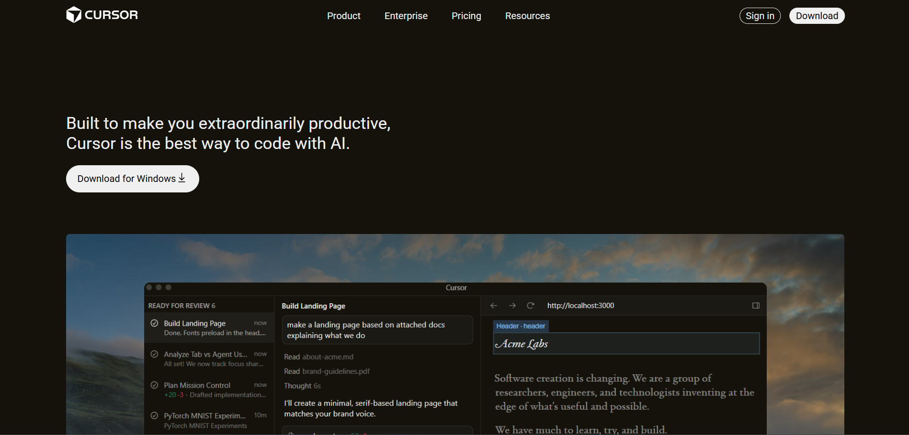
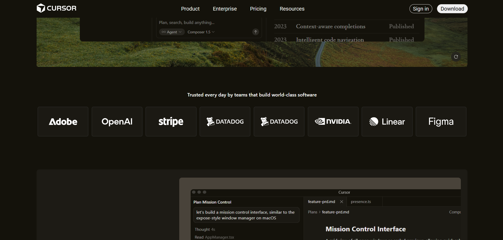
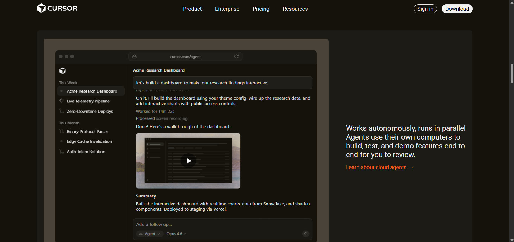
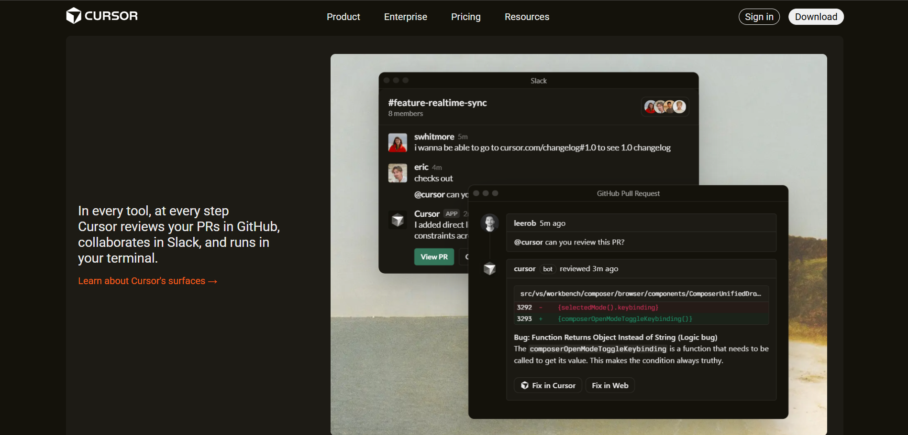
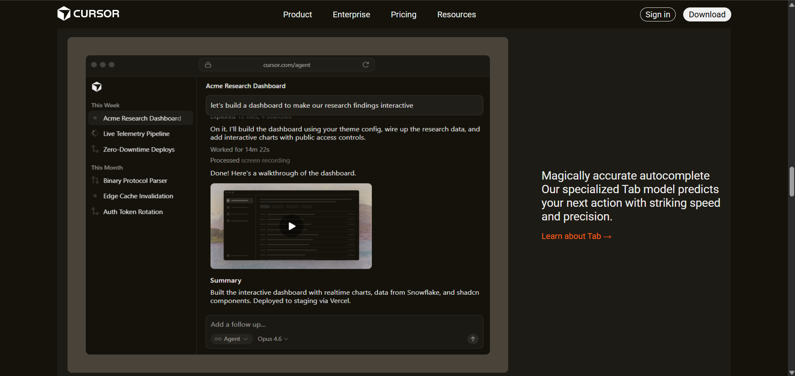
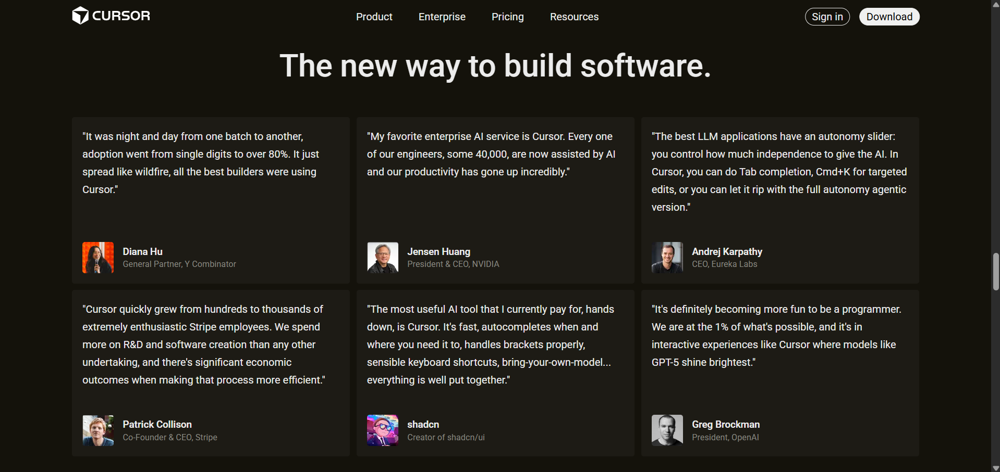
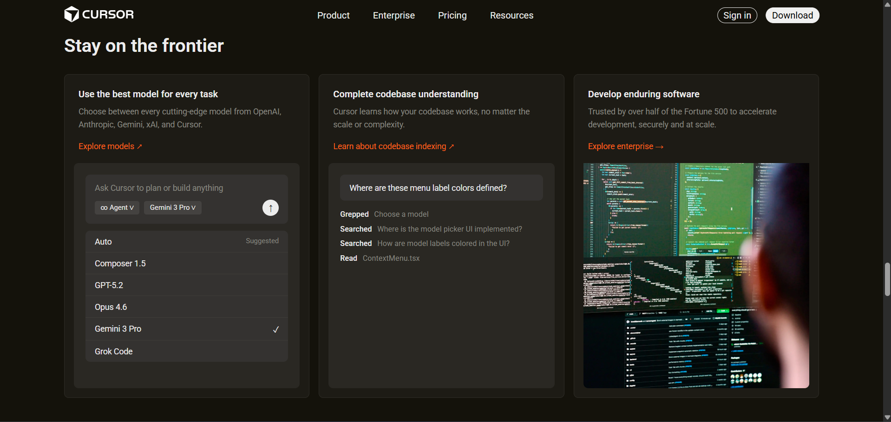
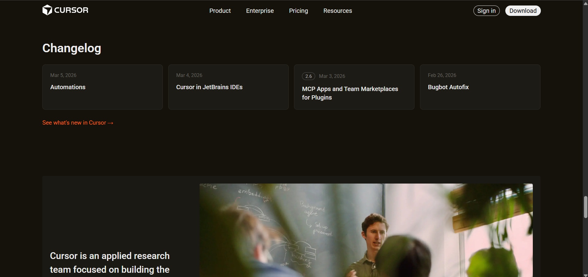
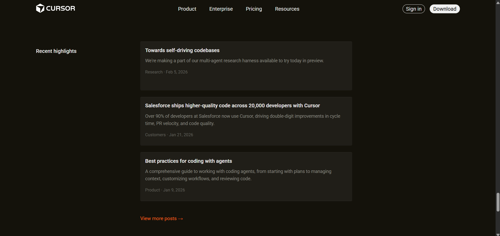
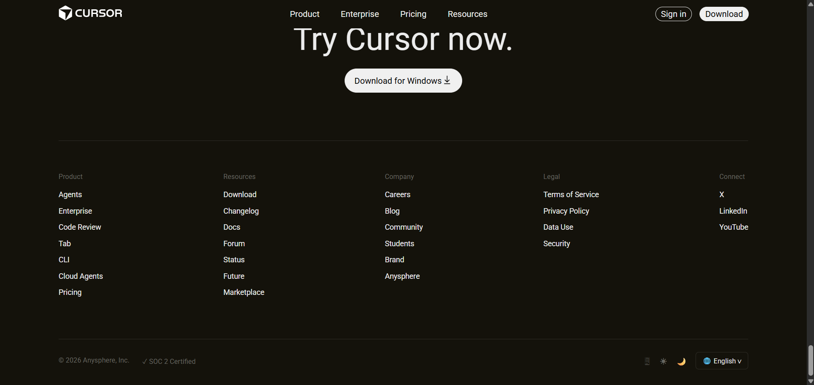

# Cursor.com — Frontend Recreations

A pixel-close HTML/CSS recreation of the [Cursor.com](https://cursor.com) landing page, built from scratch using vanilla HTML and CSS.

---

## Sections Recreated

| Section | Description |
|---|---|
| **Hero** | Full-width background image with overlay image, heading, and CTA buttons |
| **Trusted By** | Logo grid of companies including Stripe, OpenAI, NVIDIA, Figma, Adobe, and more |
| **Feature Sections** | Four alternating left/right image + text layout sections (second, third, forth, fifth) |
| **Testimonials** | 3-column grid of quote cards from industry leaders |
| **Stay on the Frontier** | 3-column feature cards with interactive UI mockups and images |
| **About / Research Team** | Split layout with company description and team photo |
| **Footer** | 5-column link grid with bottom bar including copyright and language selector |

---

## Fonts

| Font | Usage |
|---|---|
| `-apple-system, BlinkMacSystemFont, 'Segoe UI'` | System font stack used throughout for body text, nav, and UI elements |

> Cursor.com uses a system font stack for clean, native rendering across platforms.

---

## Colors

| Variable | Hex | Usage |
|---|---|---|
| Background | `#14120b` | Page and navbar background |
| Card Background | `#1D1B15` | Section and card backgrounds |
| Card Surface | `#2a2823` | Inner card visuals and inputs |
| Border | `#2e2c26` | Card borders, dividers |
| Primary Text | `#ececec` | Headings, body text |
| Secondary Text | `#888880` | Descriptions, subtitles |
| Muted Text | `#666660` | Dates, meta info, footer headings |
| Accent | `#f5601b` | Links, CTAs, hover states |
| Image Overlay | `#49433A` | Background for feature image containers |

---

---

## Built With

- HTML5
- CSS3 (Flexbox, Grid, Sticky/Fixed positioning)
- No frameworks or libraries

---

## Notes

- Navbar uses `position: fixed` with `left: 50%; transform: translateX(-50%)` for centering
- Logo images use `filter: brightness(0) invert(1)` to render all logos in white
- Feature sections alternate image-left / image-right layout using class naming: `second`, `third`, `forth`, `fifth`

## 📸 Screenshots

   
  <em>It contain the navbar and download</em>

 

   
  <em>Feature</em>

 

   

 

   

 

   

 

   

 

   

 

   

 

   

 

   

 

